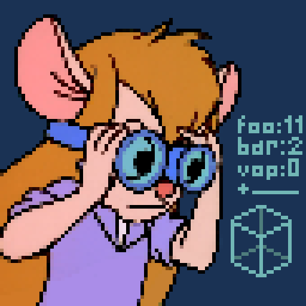

<h1 align="center">
    
    <br>
    gadget
    <br>
    <br>
    <a href="https://github.com/wisp-forest/gadget/releases">
        
    </a>
    <a href="https://discord.gg/xrwHKktV2d">
        
    </a>
</h1>
    
## Overview

Gadget is a collection of tools for mod developers, aimed at helping debug content mods.

**Build Setup:**
```properties
# https://maven.wispforest.io/io/wispforest/gadget
gadget_version=...
```

```groovy
repositories {
    maven { url 'https://oss.sonatype.org/content/repositories/snapshots' }
    maven { url 'https://maven.wispforest.io' }
}

<...>

dependencies {
    modLocalRuntime "io.wispforest:gadget:${project.gadget_version}"
    
    // if you want to use gadget's API, uncomment this
    // modCompileOnly "io.wispforest:gadget:${project.gadget_version}"
}
```
You can check the latest version on the [Releases](https://github.com/wisp-forest/gadget/releases) page

For documentation, reference the [gadget explainer video](https://www.youtube.com/watch?v=8Ok5TIvziUQ).

<!--
owo is documented in two main ways:
 - There is rich, detailed JavaDoc throughout the entire codebase
 - There is a wiki with in-depth explanations and tutorials for most of owo's features over at https://docs.wispforest.io/owo/features/
-->

## Features

 - **(Block)Entity Inspector** - deep inspection and editing of entity fields in-game, reaching right into the java code, including on server-side.
 - **Packet Dumper** - capture, save and review network traffic in-game
 
*More to come, so stay tuned!*
